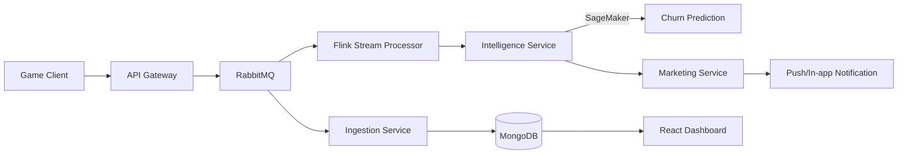

<div align="center">

</div>

# Kinetic Observatory (실시간 게임 분석 플랫폼)

본 프로젝트는 대규모 모바일 게임 유저의 실시간 데이터를 수집 및 분석하여, **AI 기반의 이탈 예측과 개인화된 마케팅 액션을 자동화**하는 통합 분석 플랫폼입니다.

---

## 📋 핵심 문서 (Core Documentation)
- **[PRD (기획서)](docu/PRD.md)**: 실시간 분석 및 마케팅 자동화의 비즈니스 가치와 요구사항 정의.
- **[Technical Architecture (기술 설계)](docu/Architecture.md)**: FastAPI, PyFlink, SageMaker를 활용한 MSA 구조 및 데이터 흐름.
- **[ERD (데이터 모델)](docu/ERD.md)**: PostgreSQL, MongoDB, Redis를 활용한 폴리글랏 퍼시스턴스 모델.
- **[Roadmap (개발 로그)](docu/roadmap.md)**: Phase 1~5에 걸친 구현 프로세스 및 결과 정리.
- **[MLOps (모델 관리)](docu/mlops.md)**: 자동화된 모델 성능 모니터링 및 재학습 파이프라인 설계.

---

## 🏗️ 시스템 아키텍처 및 데이터 흐름



---

## 📂 프로젝트 구조

- `backend/`: Python 기반 마이크로서비스 엔진
  - `api_gateway/`: FastAPI 기반 이벤트 수집기 및 통계 API
  - `ingestion_service/`: 비동기 MongoDB 적재 서비스
  - `stream_processor/`: PyFlink 기반의 실시간 스트리밍 분석 엔진
  - `intelligence_service/`: AI 모델 연동 및 이탈 예측 엔진 (SageMaker)
  - `marketing_service/`: 실시간 캠페인 자동화 액션 실행기
- `src/`: 프론트엔드 모니터링 대시보드 (React + Vite)
- `infra/`: 인프라 및 운영 설정 (`k8s`, `prometheus`)
- `docu/`: 프로젝트 상세 기술 문서

---

## 🚀 시작하기

### 1. 인프라 환경 구축 (Docker)
로컬 인프라(RabbitMQ, MongoDB, Redis, PostgreSQL)를 기동합니다.
```bash
docker-compose up -d
```

### 2. 백엔드 서비스 실행
모든 서비스는 `backend/` 폴더 내의 각 하위 폴더에서 실시간 기동 가능합니다.
```bash
cd backend
pip install -r requirements.txt
# 예시: API Gateway 실행
python api_gateway/main.py
```

### 3. 프론트엔드 대시보드
실시간 CCU 및 시스템 상태를 대시보드에서 확인합니다.
```bash
npm install
npm run dev
```

---

## 📈 주요 기술 스택
- **Backend**: Python (FastAPI), PyFlink, Pika, Motor, Boto3
- **Frontend**: React, TypeScript, Vite, TailwindCSS, Plotly, D3.js
- **Data**: MongoDB, PostgreSQL, Redis, RabbitMQ
- **Ops**: Kubernetes (EKS), Prometheus, Grafana, SageMaker (MLOps)
