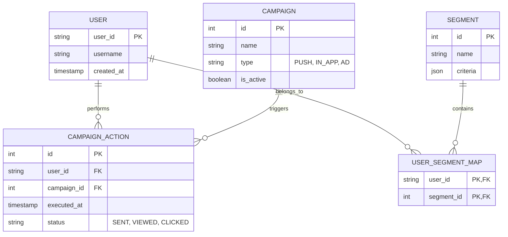

<div align="center">

</div>

# Kinetic Observatory (실시간 게임 분석 플랫폼)

이 저장소는 실시간 게임 사용자 분석 및 개인화 마케팅 플랫폼을 구축하기 위한 모든 리소스를 포함하고 있습니다.

## 📋 프로젝트 개요 (PRD 요약)
모바일 게임 유저로부터 발생하는 대규모 실시간 스트리밍 데이터를 분석하여, **이탈 예측 및 실시간 인앱 마케팅을 자동화**하는 고부하(High-load) 대응 플랫폼입니다.

- **핵심 목표**: 사용자 유지율(Retention) 향상, 수익화(Monetization) 최적화, 데이터 기반 의사결정의 자동화.
- **주요 기능**: 실시간 데이터 수집, Apache Flink 기반 스트리밍 분석, SageMaker 인텔리전스 결합, 실시간 마케팅 액션 실행.

[상세 PRD 보기](docu/PRD.md)

## 🏗️ 기술 아키텍처 (Architecture)
마이크로서비스 아키텍처(MSA)를 기반으로 AWS EKS 환경에서 동작합니다.

1.  **Ingestion**: API Gateway 및 RabbitMQ를 통한 실시간 이벤트 수집.
2.  **Processing**: Apache Flink를 이용한 초저지연 스트리밍 분석 및 배치 처리 병행.
3.  **Storage**: 데이터 특성에 맞는 폴리글랏 퍼시스턴스 (PostgreSQL, MongoDB, Redis).
4.  **Intelligence**: Amazon SageMaker를 활용한 이탈 예측 및 개인화 모델.
5.  **Action & Visualization**: 실시간 대시보드(D3.js, Plotly) 및 자동화된 푸시/AD 캠페인 실행.

[상세 아키텍처 보기](docu/Architecture.md)

## 📊 데이터 모델 (ERD)
PostgreSQL을 중심으로 한 캠페인 관리 모델과 MongoDB 기반의 로그 모델을 병합하여 운영합니다.



[상세 ERD 및 모델 정보 보기](docu/ERD.md)

---

## 📂 프로젝트 구조

- `backend/`: Python 기반 마이크로서비스 (API Gateway, Ingestion, Intelligence, Marketing)
- `docu/`: 프로젝트 상세 문서 (PRD, Architecture, ERD)
- `src/`: 프론트엔드 대시보드 (React + Vite)
- `docker-compose.yml`: 로컬 인프라 설정 (RabbitMQ, MongoDB, Redis, PostgreSQL)

---

## 🚀 시작하기

### 백엔드 설정 (로컬 환경)

1. **인프라 기동**:
   ```bash
   docker-compose up -d
   ```

2. **Python 서비스 실행**:
   ```bash
   cd backend
   pip install -r requirements.txt
   python api_gateway/main.py
   ```

### 프론트엔드 설정

1. 의존성 설치 및 실행:
   ```bash
   npm install
   npm run dev
   ```
