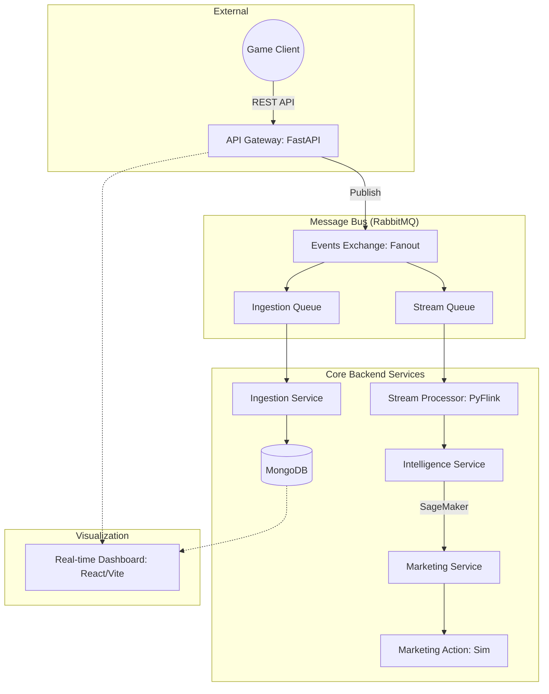

<div align="center">

</div>

# Kinetic Observatory (실시간 게임 분석 플랫폼)

본 프로젝트는 대규모 모바일 게임 유저의 실시간 데이터를 수집 및 분석하여, **AI 기반의 이탈 예측과 개인화된 마케팅 액션을 자동화**하는 통합 분석 플랫폼입니다. 

---

## 🏗️ 시스템 아키텍처 (EDA-MSA)

본 시스템은 **Fanout Exchange 기반의 Pub/Sub 아키텍처**를 채택하여 실시간 적재와 실시간 분석을 독립적으로 수행합니다.



---

## 🚀 퀵 스타트 (One-Click Setup)

본 프로젝트는 **도커(Docker)** 기술을 통해 전체 시스템(10개 컨테이너)을 한 번에 실행할 수 있도록 최적화되어 있습니다.

### 1. 전체 시스템 실행 (백엔드 + 프론트엔드 + 인프라)
```bash
# 프로젝트 루트 디렉토리에서 실행
docker-compose up -d --build
```

### 2. 접속 및 확인
- **📊 실시간 대시보드**: [http://localhost:5173](http://localhost:5173) 접속
- **📖 API 명세서 (Swagger)**: [http://localhost:8000/docs](http://localhost:8000/docs) 접속
- **🐰 RabbitMQ 관리**: [http://localhost:15672](http://localhost:15672) (ID/PW: guest/guest)

## 📖 API Reference (Swagger)

FastAPI에서 자동으로 생성되는 대화형 API 명세서를 통해 실시간으로 이력을 테스트할 수 있습니다.

1. `http://localhost:8000/docs` 접속
2. **Post /events** 클릭 -> **Try it out** 클릭
3. 샘플 JSON 데이터 수정 후 **Execute** 실행
4. 하단 **Curl** 및 **Response** 확인

---

## 📂 프로젝트 구조

- `backend/`: Python 기반 마이크로서비스 엔진
  - `api_gateway/`: 이벤트 수집 및 Pub/Sub 발행 대문
  - `ingestion_service/`: 비동기 MongoDB 적재 서비스
  - `stream_processor/`: PyFlink 기반 실시간 분석 엔진
  - `intelligence_service/`: 예측 모델 연동 엔진
  - `marketing_service/`: 마케팅 자동화 실행 엔진
- `Dockerfile.frontend`: 리얼타임 대시보드 배포 설정
- `docu/`: 프로젝트 상세 기술 문서 및 연동 가이드
- `infra/`: Kubernetes(EKS), Prometheus 모니터링 설정

---

## 📈 주요 기술 스택

- **Backend**: Python 3.10, FastAPI, **PyFlink 1.18**, Pika, Motor
- **Frontend**: React 19, Vite 6, TailwindCSS, Recharts
- **Data**: MongoDB, Redis, PostgreSQL, RabbitMQ
- **Ops**: Docker, Kubernetes, AWS SageMaker (MLOps Ready)

---

## 📋 문서 바로가기
- **[Architecture (기술 설계)](docu/Architecture.md)**: 다중 큐 분산 구조 및 상세 레이어 설명.
- **[Integration Guide (검증 완료)](docu/integration_guide.md)**: 전 구간 통합 테스트 성공 레포트.
- **[Roadmap (개발 완료)](docu/roadmap.md)**: Phase 1~5 최종 성과 및 요약.
