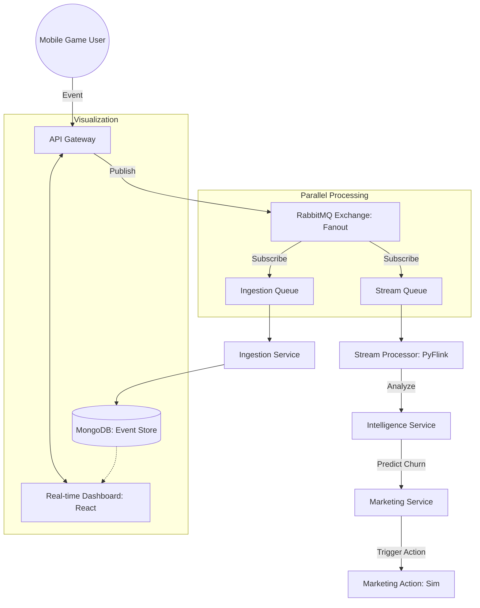

# 기술 아키텍처 (Technical Architecture)

본 플랫폼은 고부하 실시간 데이터 처리와 지능형 자동화를 위해 **이벤트 중심 마이크로서비스 아키텍처(EDA-MSA)**로 설계 및 구현되었습니다.

## 1. 전반적인 워크플로우 (Data Flow)

## 2. 계층별 상세 스택

### 2.1 수집 및 분산 레이어 (Ingestion & Distribution)
- **API Gateway (FastAPI)**: 고성능 비동기 처리를 통해 초당 수만 건의 이벤트를 수용합니다.
- **RabbitMQ Fanout Exchange**: 메시지를 특정 큐가 아닌 익스체인지에 발행하여, **Ingestion**과 **Analysis** 서비스가 동일한 데이터를 독립적으로 처리할 수 있는 **Pub/Sub 구조**를 실현합니다.

### 2.2 실시간 처리 레이어 (Processing Layer)
- **Stream Processor (PyFlink 1.18)**: Apache Flink를 기반으로 스트리밍 데이터를 윈도우 기반으로 실시간 가공합니다. 
- **Ingestion Service**: RabbitMQ의 데이터를 MongoDB에 비동기(`motor`)로 저장하여 지연 없이 영속성을 확보합니다.

### 2.3 저장소 레이어 (Persistence Layer)
- **MongoDB**: 대규모 비정형 이벤트 로그 저장.
- **Redis**: 실시간 CCU 및 시스템 상태 지표 관리.
- **PostgreSQL**: 마케팅 캠페인 설정 및 통계 관리.

### 2.4 지능형 서비스 레이어 (Intelligence & Action)
- **Intelligence Service**: SageMaker 기반 예측 모델 연동.
- **Marketing Service**: 룰셋 및 예측 기반 캠페인 실행 엔진.

### 2.5 시각화 레이어 (Visualization)
- **React Dashboard (Vite)**: Docker 컨테이너(Port 3000 -> 5173 매핑)로 제공되며, 백엔드 API와 실시간 연동됩니다.

## 3. 인프라 구성 (Infrastructure)
- **Docker Compose**: 전체 마이크로서비스 및 인프라를 코드 기반으로 관리(IaC).
- **PYTHONUNBUFFERED**: 모든 컨테이너의 실시간 로그 출력을 보장하여 모니터링 품질 확보.