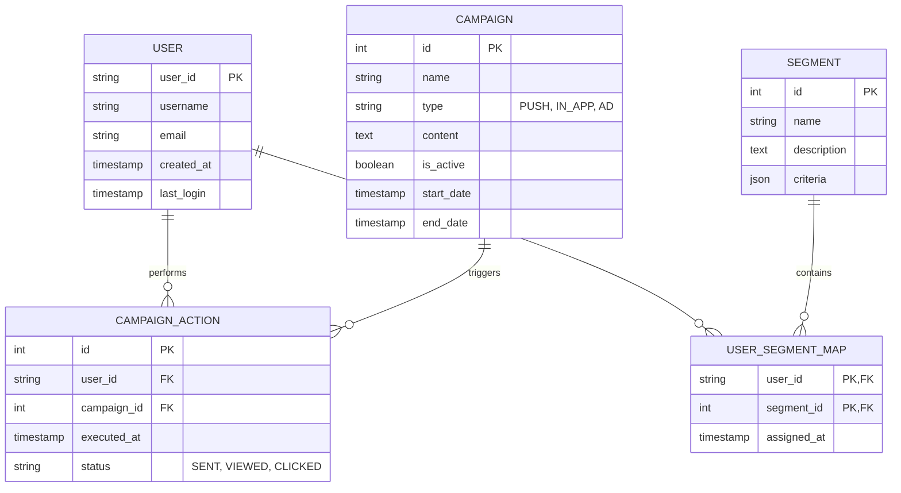

# Entity Relationship Diagram (ERD)

본 플랫폼은 **폴리글랏 퍼시스턴스(Polyglot Persistence)** 전략을 채택하여, 데이터의 성격에 따라 PostgreSQL(RDBMS)과 MongoDB(NoSQL)를 병행하여 사용합니다.

## 1. 관계형 데이터 모델 (PostgreSQL)
주로 마케팅 캠페인 관리, 사용자 마스터 정보, 캠페인 실행 이력 등 엄격한 일관성이 필요한 데이터를 관리합니다.

## 2. 비정행 데이터 모델 (MongoDB)
대규모 사용자 행동 로그 및 가변적인 사용자 프로필 정보를 저장합니다.

- **UserProfiles (Collection)**:
    - `user_id`: 사용자 식별자
    - `device_info`: { OS, 모델, 해상도 등 }
    - `preferences`: { 언어, 알림 설정 등 }
    - `attributes`: 유동적인 속성값들
- **BehavioralLogs (Collection)**:
    - `event_id`: 이벤트 고유 ID
    - `user_id`: 사용자 식별자
    - `event_type`: "CLICK", "LEVEL_UP", "PURCHASE" 등
    - `timestamp`: 발생 시각
    - `payload`: 이벤트별 상세 데이터 (JSON)

## 3. 실시간 저장소 (Redis)
- **Sessions**: 실시간 유저 세션 관리
- **Leaderboards**: 실시간 점수 순위 관리
- **Cache**: 잦은 조회가 발생하는 마스터 정보 캐싱
